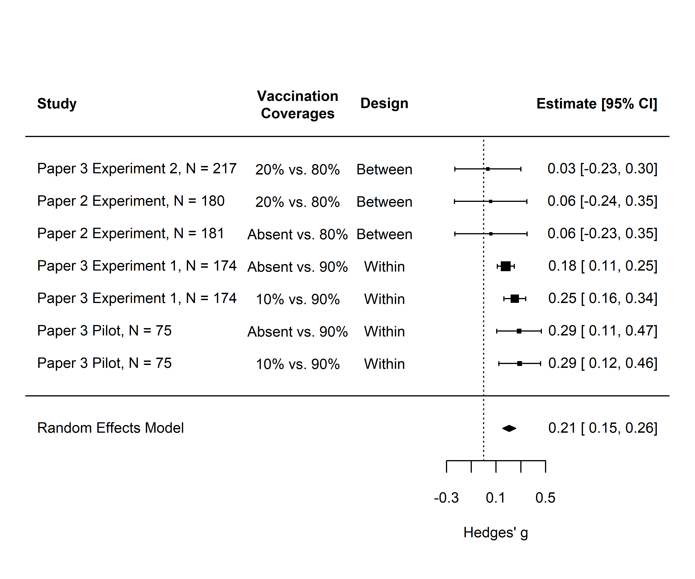

# Mini Meta-Analysis of Vaccination Coverage Message Effects

An internal meta-analysis of changes in vaccination intention from the situation when no or low (10% or 20%) vaccination coverage was communicated to the situation when high (80% or 90%) vaccination coverage was communicated.

It is reported in the doctoral dissertation by Aleksandra Lazić, _Communicating Vaccination Coverage: Testing the Selfish versus the Social Rationality Hypothesis_ (University of Belgrade, Faculty of Philosophy) from 2025; available Open Access at: https://nardus.mpn.gov.rs/handle/123456789/23608 

## Forest Plot

## Data Sources

Effects for "Paper 2 Experiment" were computed using the data reported in:

* Lazić, A., Kalinova, K. N., Packer, J., Pae, R., Petrović, M. B., Popović, D., Sievert, D. E. C., & Stafford-Johnson, N. (2021). Social nudges for vaccination: How communicating herd behaviour influences vaccination intentions. _British Journal of Health Psychology_, _26_(4), 1219–1237. https://doi.org/10.1111/bjhp.12556 (Open Access)

Effects for "Paper 3 Experiment 1" and "Paper 3 Experiment 2" were computed using the data reported in:

* Lazić, A., & Žeželj, I. (2025). Should public communication of vaccination rates assume rationality, normativity or reasonableness? Insights from three preregistered experiments. _Psychological Reports_. Online first. https://doi.org/10.1177/00332941251340326 (Open Access)

Effects for "Paper 3 Pilot" were computed using the data reported in the Supplementary of Lazić & Žeželj (2025) openly available at https://osf.io/2jsrc.

## Repository Contents

This repository contains the following data:

* **dataset** and **codebook** (vacc_cvrg_meta.csv and vacc_cvrg_meta_codebook.csv)
* **R code** (vacc_cvrg_meta.R) to reproduce the meta-analysis, including calculating effect sizes and sampling variances, and creating the forest plot
* **HTML document** (vacc_cvrg_meta.html) with results and references for software and packages used; created from a .Rdm file; can be previewed here: https://htmlpreview.github.io/?https://github.com/ale-lazic/vacc_cvrg_meta/blob/1d79d6506bc5dca5333fa05cbfb95953817e904b/vacc_cvrg_meta.html
* **forest plot** (vacc_cvrg_meta_forestplot.png)
